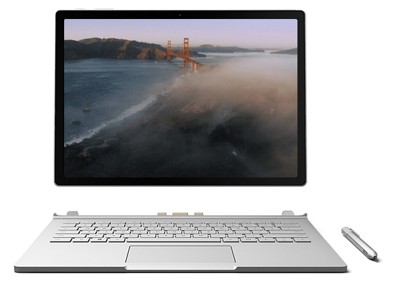

## Aerial - Apple TV Aerial Views Screen Saver for Windows 7, 8, 10+
Aerial is a Windows screen saver based on the new Apple TV screen saver that displays the aerial movies Apple shot over New York, San Francisco, Hawaii, China, etc.

Aerial is based on the Mac Screen saver by John Coates/Aerial

#### Coded with Love by Dmitry Sadakov

## Download
Download from [Github](https://github.com/cdima/Aerial/releases/download/v0.1/Aerial.scr.zip)

**Option A:** Right click Aerial.scr and choose Install, windows will install it for you.

**Option B:** Unzip the Aerial.scr and double-click to launch. 

## Features
* **Auto Load Latest Aerials:** Aerials are loaded directly from Apple, so you're never out of date.
* **Play Different Aerial On Each Display:** If you've got multiple monitors, this setting loads a different aerial for each of your displays.

## Compatibility
Aerial is written in C# for [.Net Framework v4.6](https://www.microsoft.com/en-us/download/details.aspx?id=48130).

## Community
- **Find a bug?** [Open an issue](https://github.com/cdima/Aerial/issues/new). Try to be as specific as possible.
- **Have a feature request** [Open an issue](https://github.com/cdima/Aerial/issues/new). Tell me why this feature would be useful, and why you and others would want it.

## Contribute
I appreciate all pull requests. Caching hasn't been added yet.

## Changelog

- October 27th, 2015 - 1.0: First release.

## License
[MIT License](https://raw.githubusercontent.com/JohnCoates/Aerial/master/LICENSE)
